# uart-bridge

wireless UART console for your router - access it from the browser, no serial cable needed

## what is this

you solder four wires to your router's UART pads, plug in an ESP32-C3, and now you have a wireless serial console you can open in any browser. no more sitting next to the router with a USB-TTL adapter.

the ESP32 bridges the router's UART to TCP (telnet on port 23) and also runs a web terminal with ANSI color rendering, session recording, OTA updates, and a config panel. the ESP32 itself costs ~5 PLN (~$1.20), less than a loaf of bread.

this was my first electronics project. built for DD-WRT router hacking but works with anything that has a UART - OpenWrt, stock firmware, embedded linux, microcontrollers, whatever.

## features

- **wireless UART bridge** - UART to TCP on port 23 with password auth, works with any telnet client
- **web terminal** - browser-based serial console with ANSI color rendering
- **session recording** - save UART sessions to flash, download as raw or clean (ANSI-stripped) text files
- **90KB ring buffer** - keeps the last 90KB of UART output in RAM
- **OTA updates** - upload new firmware from the browser, no USB needed after first flash
- **web config panel** - change WiFi, passwords, baud rate, static IP, mDNS hostname, AP fallback password, all from the browser
- **theme switcher** - three themes: green cyberpunk, dark purple, light purple
- **first-time setup wizard** - on fresh flash, starts AP mode and walks you through initial configuration
- **static IP** - configurable static IP so your bridge is always at the same address
- **mDNS** - access via `http://uart.local` instead of remembering the IP
- **AP fallback** - if WiFi fails, creates its own access point using the chip's hostname (ESP32C3-XXXXXX) with password `Password123`
- **UART boot delay** - keeps UART pins disconnected (high-impedance) during boot so the router doesn't hang. some routers like the R7000 fail to boot when something is driving the UART pins during startup


## bill of materials

| part | spec | price (PLN) | notes |
|---|---|---|---|
| ESP32-C3 SuperMini | 4MB flash, USB-C | ~4-12 zl | aliexpress, the tiny one |
| jumper wires | dupont wires | ~3-5 zl | pack of 40, you need 4 |
| USB-C cable | for power + first flash | ~8 zl | you probably already have one |
| pin headers (optional) | 2.54mm male | ~1-2 zl | if your router pads need them |
| soldering iron (optional) | any temp-controlled | ~60 zl | if you don't already have one |
| **total** | | **~15-87 zl** | cheaper than a USB-TTL adapter setup |

you also need a router with UART pads exposed. most routers have them - check your model on [OpenWrt](https://openwrt.org/toh/start) or [DD-WRT](https://wiki.dd-wrt.com/) wiki for pinout, or just open the case and look for pads labeled TX, RX, GND, VCC near the edge of the board.

## wiring

```
  Router UART          ESP32-C3 SuperMini
  ============         ==================

  TX  o────────────────o  GPIO 20 (RX)
  RX  o────────────────o  GPIO 21 (TX)
  GND o────────────────o  GND
  VCC o────────────────o  3.3V
```

| router pad | ESP32-C3 pin | wire color (suggestion) | notes |
|---|---|---|---|
| TX | GPIO 20 (RX) | green | data from router |
| RX | GPIO 21 (TX) | white | data to router |
| GND | GND | black | required |
| VCC (3.3V) | 3.3V | red | power from router |

**powering the ESP32:**

- **router VCC (3.3V)** - solder the VCC pad to the ESP32's 3.3V pin. the ESP32 powers on with the router, no extra cables needed. best for a permanent install inside the case
- **USB power** - plug in a USB-C cable instead of using VCC. useful for testing, development, or if your router doesn't have a VCC pad
- **battery** - a 3.7V LiPo with a regulator or a USB power bank works if you want standalone/portable use

> **WARNING:** never connect both USB and router VCC at the same time. you will backfeed voltage into the router and potentially fry something. pick one power source.

**important things:**

- router UART is usually 3.3V logic. the ESP32-C3 is also 3.3V. no level shifter needed
- TX/RX are crossed - router TX goes to ESP32 RX and vice versa
- if your router has 1.8V UART (some newer broadcom chips), you need a level shifter
- if powering from router VCC, make sure it's actually 3.3V - measure with a multimeter first
- check your router's baud rate - most are 115200 but some use 57600 or other speeds

## setup

### first flash (USB)

1. install [Arduino IDE](https://www.arduino.cc/en/software) or [Arduino CLI](https://arduino.github.io/arduino-cli/)
2. add ESP32 board support - paste this URL in board manager:
   ```
   https://raw.githubusercontent.com/espressif/arduino-esp32/gh-pages/package_esp32_index.json
   ```
3. install `esp32` board package
4. select board **ESP32C3 Dev Module** with these settings:

| setting | value |
|---|---|
| Board | ESP32C3 Dev Module |
| USB CDC On Boot | Enabled |
| CPU Frequency | 160MHz |
| Flash Size | 4MB |
| Partition Scheme | Default |
| Upload Speed | 921600 |

5. open `uart_bridge_full.ino` and flash it
6. on first boot, the setup wizard will ask for WiFi credentials and other settings. you can also edit the defaults at the top of the file before flashing:
   ```cpp
   String wifi_ssid = "YourWiFi";
   String wifi_password = "YourPassword";
   ```

### first boot

on a fresh flash with no saved config, the ESP32 starts in AP mode and launches a setup wizard. connect to the AP (something like `ESP32C3-A1B2C3`, password `Password123`) and open `http://192.168.4.1` in your browser. the wizard asks for WiFi SSID, WiFi password, bridge password, web panel password, and baud rate. after saving, the ESP32 reboots and connects to your WiFi.

on subsequent boots, the ESP32 connects to your saved WiFi. if WiFi fails after 20 seconds, it falls back to AP mode using the chip's hostname with password `Password123`. check serial monitor for the exact SSID.

### accessing the web panel

- by IP: whatever your router assigned (or static IP if configured)
- by mDNS: `http://uart.local`
- enter the web panel password (`esp32` by default) and click Login

### connecting via telnet

```bash
# linux/mac
telnet 192.168.1.100

# windows
putty -> raw -> 192.168.1.100 port 23
```

password is `root` by default.

### updating firmware (OTA)

after the first USB flash, you never need a cable again:

1. compile in Arduino IDE: Sketch -> Export Compiled Binary
2. open `http://uart.local/update` in your browser (login required)
3. upload the `.bin` file and wait for the reboot

## configuration

all settings are configurable from the web panel at `/config`:

| setting | default | description |
|---|---|---|
| WiFi SSID | YourWiFi | your home WiFi network |
| WiFi Password | YourPassword | your WiFi password |
| Bridge Password | root | password for telnet (port 23) |
| Web Panel Password | esp32 | password for the web UI login |
| UART Baud Rate | 115200 | must match your router |
| TCP Port | 23 | telnet port |
| UART Boot Delay | 10s | seconds to keep UART pins disconnected after boot |
| AP Fallback Password | Password123 | password for the fallback access point |
| Static IP | *(empty, DHCP)* | leave empty for DHCP |
| Gateway | 192.168.1.1 | your router IP |
| Subnet | 255.255.255.0 | network mask |
| mDNS Hostname | uart | accessible as hostname.local |
| Theme | Green Cyberpunk | green cyberpunk, dark purple, or light purple |

all settings persist across reboots and are configurable from the web panel.

## web panel pages

| page | path | what it does |
|---|---|---|
| Setup | `/setup` | first-time setup wizard (only on fresh flash) |
| Login | `/` | password login |
| Status | `/panel` | WiFi info, UART stats, uptime, RAM usage |
| Terminal | `/terminal` | live UART console with ANSI colors |
| Logs | `/logs` | saved session recordings, download raw or clean |
| Config | `/config` | all settings, theme switcher, factory reset |
| OTA | `/update` | firmware upload (requires login) |

## session recording

1. open the terminal page
2. click **Record** - button turns red
3. do your thing in the console
4. click **Stop Rec**
5. go to **Logs** page
6. download as **Raw** (with ANSI codes) or **Clean** (plain text, escape codes stripped)

recordings are saved to flash (1.4MB available). they persist across reboots.

## photos

### hardware

the ESP32-C3 SuperMini next to a USB drive for scale - smaller than your thumb

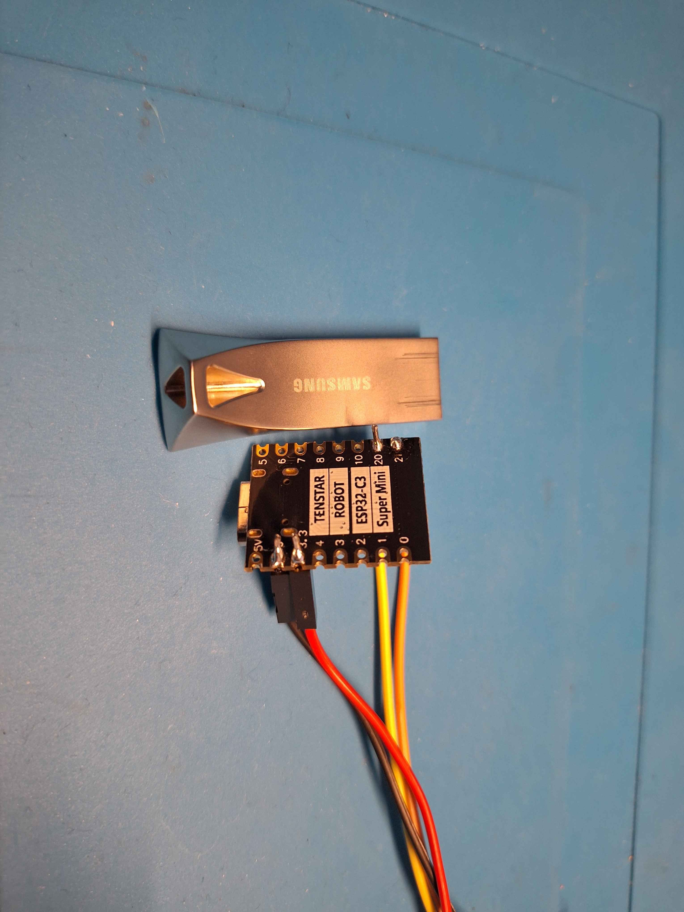

four wires soldered to the ESP32 - TX, RX, GND, VCC with dupont connectors

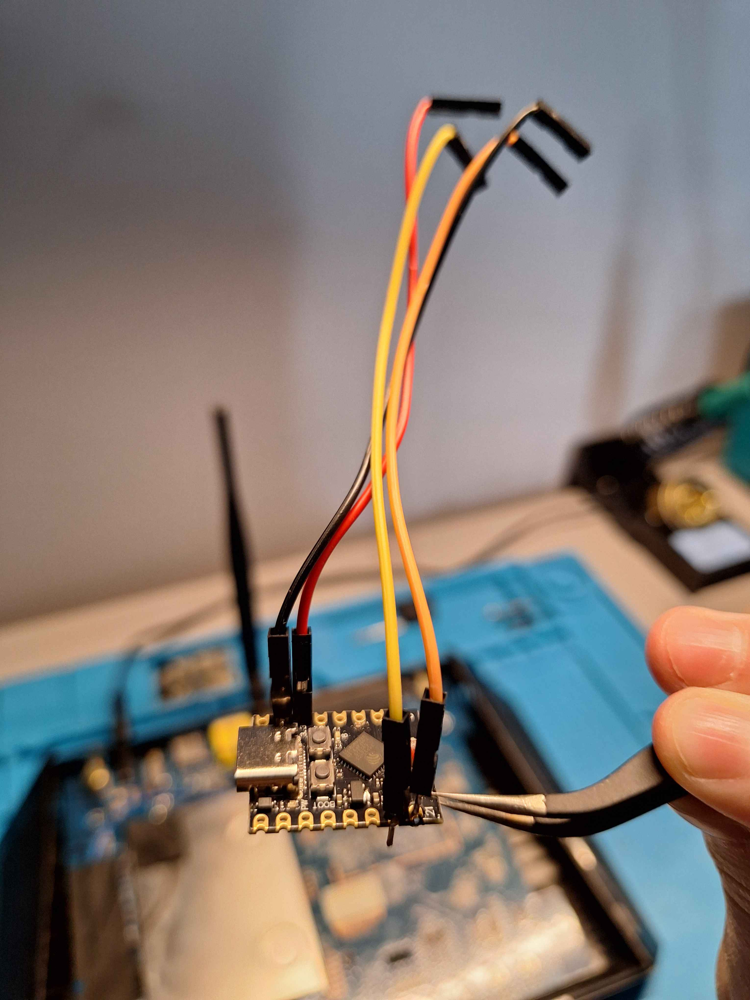

wired up to a Netgear R7000 board with the case open

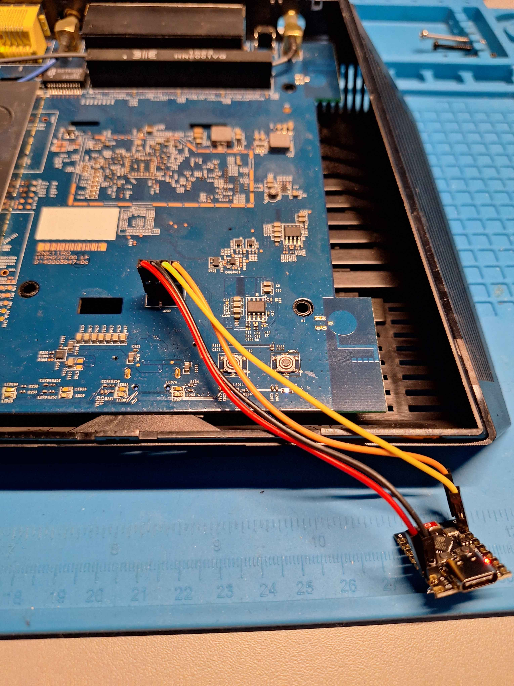

ESP32 tucked into the corner of the R7000, LED visible - ready to close the case

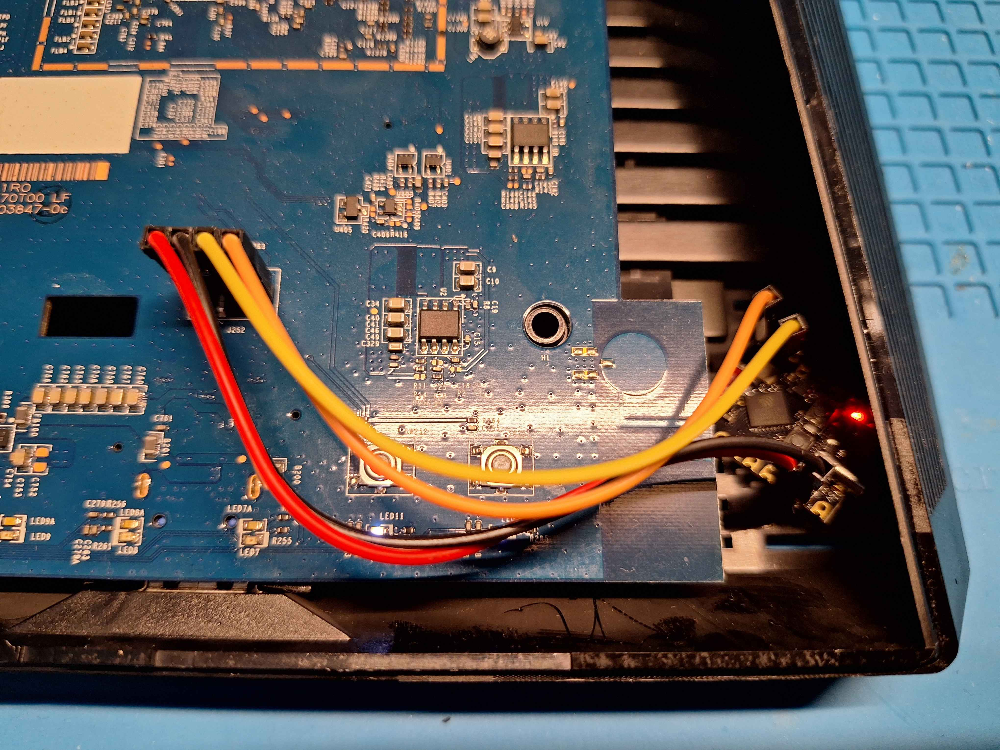

### screenshots

first boot setup wizard - connect to the ESP32's AP and fill in your WiFi and passwords

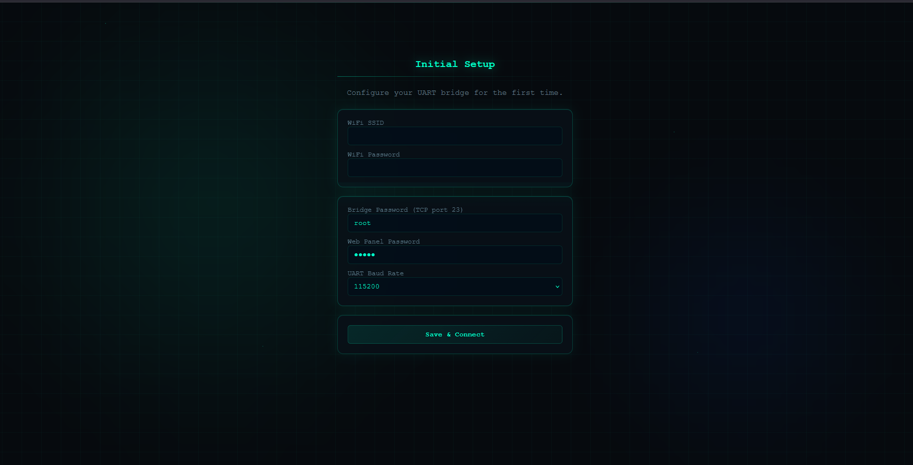

login page - enter the web panel password to get in

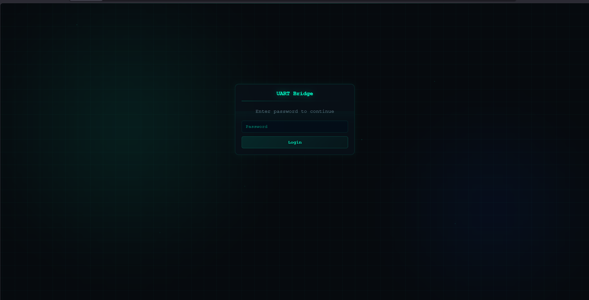

status page - WiFi info, UART stats, uptime, free RAM, CPU temp

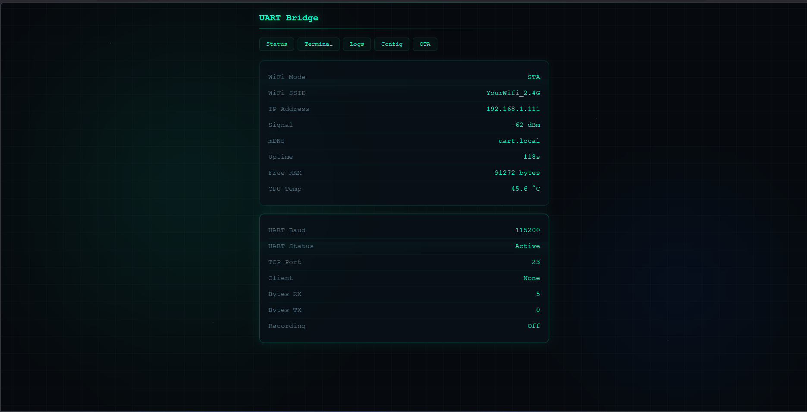

web terminal - live UART output from DD-WRT with colored shell prompt

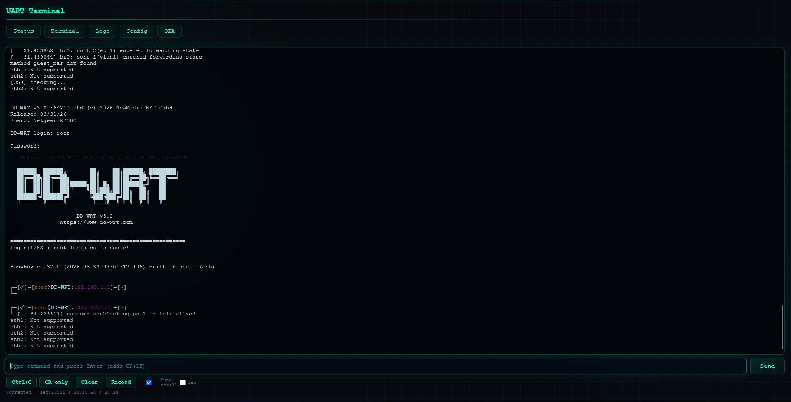

config page (dark purple theme) - theme switcher, WiFi, passwords, baud rate, boot delay, static IP

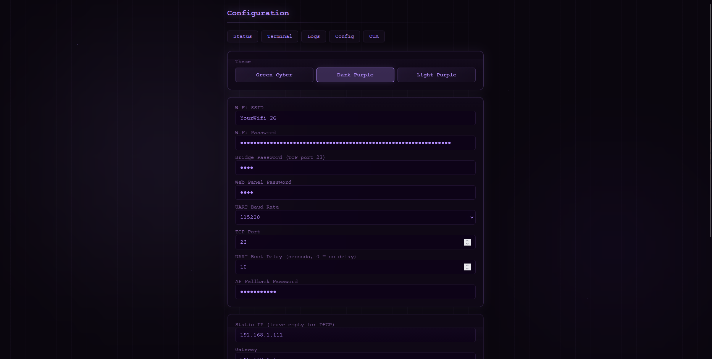

config page continued - network settings, save & reboot, factory reset

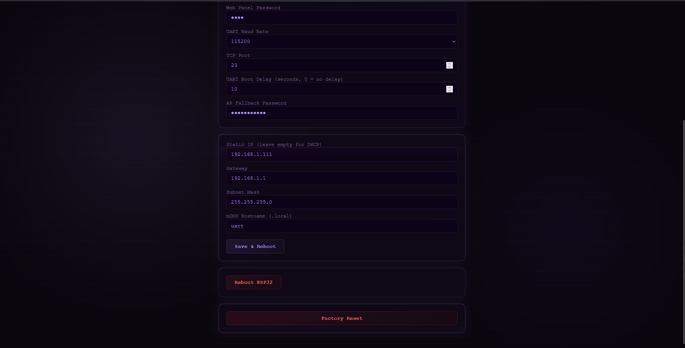

OTA update page - upload new firmware from the browser

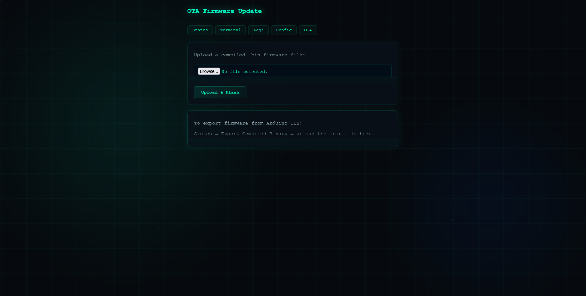

## known issues

- the web terminal polls every 300ms - there's a slight delay compared to a direct serial connection
- UTF-8 sequences split across poll boundaries are handled but might occasionally glitch
- session recordings can fill up the 1.4MB flash partition if you leave them running for hours
- mDNS might not work on some older Android devices

## license

MIT - do whatever

made by [Tymbark7372](https://github.com/Tymbark7372)
